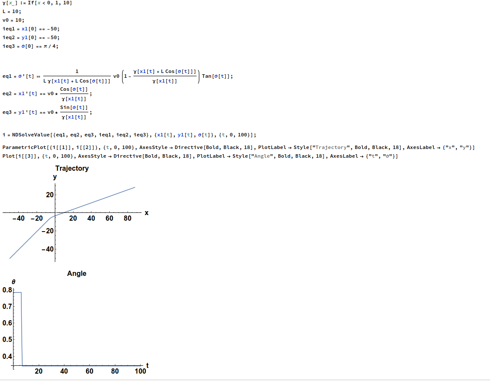

We have an infinitely thin rod. We describe the rod using its two end points $(\mathbf r_2,\mathbf r_1)$

We can describe the motion of the rod using the following equation:

$$
\begin{aligned}
\gamma(\mathbf r_2) \frac{\partial \mathbf r_2}{\partial t} = v_0 \mathbf u + F(\mathbf r_2,\mathbf r_1) \\
\gamma(\mathbf r_1) \frac{\partial \mathbf r_1}{\partial t} = v_0 \mathbf u + F(\mathbf r_1,\mathbf r_2)
\end{aligned}
 $$

 where we have introduced an orientation $\mathbf u$ and a spatially dependent viscosity $\gamma_2$ and we have in principle that the rod is deformable along the the axis with a pairwise force acting between the two points $F(\mathbf r_1,\mathbf r_2)$ 

 I shall now make the assumption that the length is constrained to be a particular length rather than including the effects of the forces:

 $$(\mathbf r_2-\mathbf r_1)^2 =  L^2 $$

 This constraint is satisfied by:

 $$ \mathbf r_2 = \mathbf r_1 + L(\cos(\theta),\sin(\theta)) $$

 We solve the equations: 

 $$
\begin{aligned}
\gamma(\mathbf r_2) \frac{\partial \mathbf r_2}{\partial t} = v_0 \mathbf u  \\
\gamma(\mathbf r_1) \frac{\partial \mathbf r_1}{\partial t} = v_0 \mathbf u 
\end{aligned}
 $$
 under this constraint. We now also select that the rod is being propelled along its axis

 $$
\mathbf u = (\cos(\theta),\sin(\theta))
 $$

We take the $\mathbf r_2$ equation and substitute our rigid constraint equation. This leads to:
$$
\begin{aligned}
\gamma(\mathbf r_2) \frac{\partial \mathbf r_1}{\partial t} +L \gamma(\mathbf r_2) \frac{\partial \mathbf u}{\partial t} = v_0 \mathbf u  \\
\gamma(\mathbf r_1) \frac{\partial \mathbf r_1}{\partial t} = v_0 \mathbf u 
\end{aligned}
$$

We can use the second equation to substitute into the first, obtaining:
$$
\begin{aligned}
\frac{\partial \mathbf u}{\partial t} =\frac{1}{L \gamma(\mathbf r_1+ L \mathbf u) } \bigg(1-\frac{\gamma(\mathbf r_1+ L \mathbf u)}{\gamma(\mathbf r_1)}\bigg)v_0 \mathbf u  \\
\gamma(\mathbf r_1) \frac{\partial \mathbf r_1}{\partial t} = v_0 \mathbf u 
\end{aligned}
$$

Solving this numerically for $\theta, x_1, y_1$. Below is an example mathematica notebook of such

