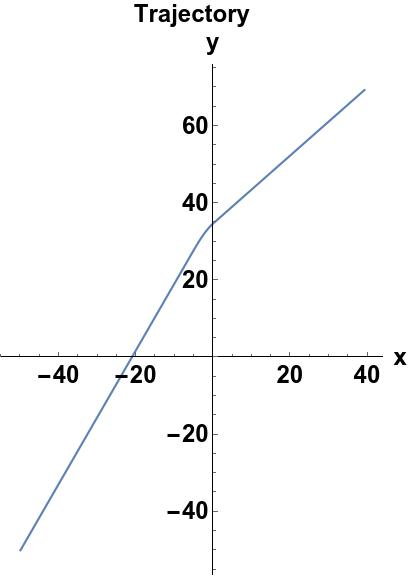
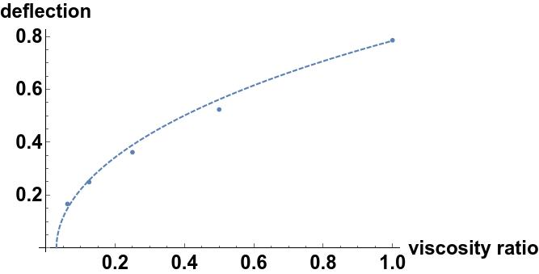

# Simple toy model which produces Snell's law (1)
For a rod swimming in $\mathbf u$ with a differential in viscosity
 We solve the equations: 

 $$
\begin{aligned}
\gamma(\mathbf r_2) \frac{\mathrm{d} \mathbf r_2}{\mathrm{d} t} = F_0 \mathbf u +\mathbf F_1(t) \\
\gamma(\mathbf r_1) \frac{\mathrm{d} \mathbf r_1}{\mathrm{d} t} = F_0 \mathbf u +\mathbf F_2(t)
\end{aligned}
 $$
with the following collective coordinates

$$\mathbf R=(\mathbf r_2+ \mathbf r_1)/2 , \,\,\,\ \mathbf x = (\mathbf r_2 - \mathbf r_1)/2=L(t) (\cos(\theta(t)),\sin(\theta(t)))$$

$\mathbf F_1(t),\mathbf F_2(t)$ are unknown functions arising from the interior forces

---

# Simple toy model which produces Snell's law (2)

After some algebra from this, we obtain:

 $$
\begin{aligned}
\frac{\mathrm{d} \mathbf R}{\mathrm{d}t} &= \frac{1}{2}\left(\frac{1}{\gamma(\mathbf R+\mathbf x)}+\frac{1}{\gamma(\mathbf R-\mathbf x)}\right)F_0 \mathbf u +\frac{1}{2}\left(\frac{\mathbf F_1(t)}{\gamma(\mathbf R-\mathbf x)}+\frac{\mathbf F_2(t)}{\gamma(\mathbf R+\mathbf x)}\right) \\
\frac{\mathrm d \mathbf x}{\mathrm d t} &=  \frac{1}{2}\left(\frac{1}{\gamma(\mathbf R+\mathbf x)}-\frac{1}{\gamma(\mathbf R-\mathbf x)}\right)F_0 \mathbf u +\frac{1}{2}\left(\frac{\mathbf F_2(t)}{\gamma(\mathbf R+\mathbf x)}-\frac{\mathbf F_1(t)}{\gamma(\mathbf R-\mathbf x)}\right)
\end{aligned}
 $$

and now we search for solutions of the latter equation. This may seem difficult, but we search for solutions such as the total length of the rod is unchanged

$$ \dot L(t)=0 $$

---

# Simple toy model which produces Snell's law (3)

The condition above leads to the following condition for the forces $\mathbf F_1(t),\mathbf F_2(t)$

$$ \mathbf F_1(t) \cos(\theta) + \mathbf F_2(t) \sin(\theta) =  \frac{1}{2}\left(\frac{1}{\gamma(\mathbf R+\mathbf x)}-\frac{1}{\gamma(\mathbf R-\mathbf x)}\right)F_0 \mathbf u = \mathbf f(t) $$

One such solution is 
$$ \mathbf F_1(t) = \mathbf f(t) \cos(\theta), \,\,\,\mathbf F_2(t) = \mathbf f(t) \sin(\theta)$$

which corresponds to a system with no compression and also no rotation. However, this isn't the only form of these two forces which guarantees the length constraint. For example:

$$ \mathbf F_1(t) = \frac{1}{2} \frac{\mathbf f(t)}{\cos(\theta)}, \,\,\,\mathbf F_2(t) = \frac{1}{2} \frac{\mathbf f(t)}{\sin(\theta)}$$

also works. 

---

# Consequences of different functions that satisfy the length constraints

The simple form satisfying the length constraint gives a differential equation for $\theta(t)$

$$
\frac{\mathrm{d}\theta}{\mathrm{d}t} =\frac{1}{2}\left(\frac{1}{\gamma(\mathbf R+\mathbf x)}-\frac{1}{\gamma(\mathbf R-\mathbf x)}\right)F_0\left(-\cot(\theta)+\frac{1}{\cos(\theta)\sin(\theta)}\right)
$$

The solution to this equation is (assuming gamma is not changing in time):

$$ \theta(t) = \sin ^{-1}\left(\sin \left(\theta _0\right) e^{\frac{F_0 t}{2}
   \left(\frac{1}{\gamma (R+x)}-\frac{1}{\gamma
   (R-x)}\right)}\right) $$

   A snell's law! A fitting parameter being the crossing time.

---

# Example solutions

The deflection graph is a fit to simulation data